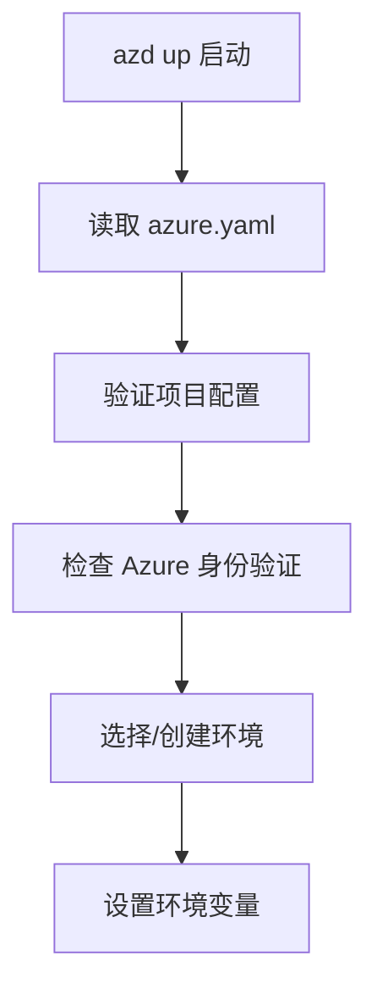
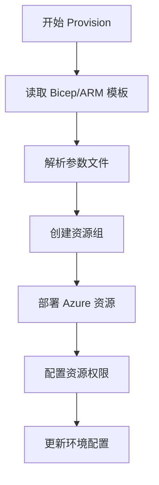
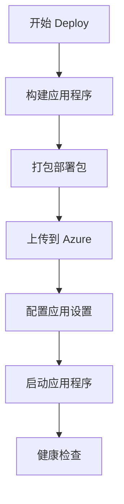
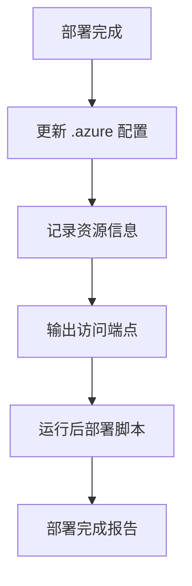

# Azure Developer CLI (azd up) 完整功能文档

## 概述

`azd up` 是 Azure Developer CLI 的核心命令，提供**一键式端到端部署**解决方案。它将基础设施预配和应用程序部署整合为单一命令，大大简化了 Azure 应用的部署流程。

## 命令语法

```bash
azd up [flags]
```

## 核心功能

### `azd up` = `azd provision` + `azd deploy`

`azd up` 内部执行两个主要步骤：

1. **Infrastructure Provisioning** (基础设施预配)
2. **Application Deployment** (应用程序部署)

---

## 详细执行流程

### 阶段 1: 环境准备与验证



#### 执行内容：
- **配置文件验证**：检查 `azure.yaml` 是否存在且格式正确
- **身份验证检查**：确保已登录 Azure (`az login`)
- **环境管理**：选择现有环境或创建新环境
- **订阅验证**：确认目标 Azure 订阅

### 阶段 2: 基础设施预配 (azd provision)



#### 执行内容：

##### 2.1 模板处理
- 读取 `infra/main.bicep` (或 ARM 模板)
- 解析 `infra/main.parameters.json`
- 替换环境变量 (`${AZURE_ENV_NAME}`, `${AZURE_LOCATION}`)

##### 2.2 资源创建
根据模板创建以下 Azure 资源：
- **Resource Group** (资源组)
- **App Service Plan** (应用服务计划)
- **Function App** (函数应用)
- **Storage Account** (存储账户)
- **Application Insights** (应用程序洞察)
- **其他依赖资源** (如数据库、Key Vault 等)

##### 2.3 权限配置
- 设置 Managed Identity
- 配置 RBAC 角色分配
- 设置存储账户访问权限

##### 2.4 网络配置
- 配置虚拟网络 (如果需要)
- 设置防火墙规则
- 配置私有端点 (如果启用)

### 阶段 3: 应用程序部署 (azd deploy)



#### 执行内容：

##### 3.1 代码构建
- **Python 项目**：安装依赖 (`pip install -r requirements.txt`)
- **Node.js 项目**：运行 `npm install` 和 `npm run build`
- **其他语言**：执行相应的构建命令

##### 3.2 包打包
- 创建部署包 (ZIP 文件)
- 包含所有应用文件和依赖
- 排除不必要的文件 (基于 `.funcignore` 或 `.gitignore`)

##### 3.3 部署上传
- 上传部署包到 Azure Storage
- 触发 Function App 的部署流程
- 等待部署完成

##### 3.4 配置同步
- 设置应用程序设置 (App Settings)
- 配置连接字符串
- 设置环境变量

### 阶段 4: 后部署配置



#### 执行内容：
- **更新 `.azure/dev/.env`** 文件
- **记录资源 ID 和端点**
- **执行后部署钩子** (如果定义)
- **显示部署摘要**

---

## 支持的项目类型

### 1. Azure Functions
```yaml
# azure.yaml 示例
name: my-function-app
services:
  api:
    project: .
    host: function
    language: python
```

### 2. Azure Container Apps
```yaml
name: my-container-app
services:
  web:
    project: ./src
    host: containerapp
    docker:
      path: ./Dockerfile
```

### 3. Azure App Service
```yaml
name: my-web-app
services:
  web:
    project: .
    host: appservice
    language: python
```

### 4. Azure Static Web Apps
```yaml
name: my-static-app
services:
  web:
    project: ./frontend
    host: staticwebapp
```

---

## 配置文件详解

### azure.yaml
项目的主配置文件：

```yaml
# 项目名称
name: mcp-sql-server

# 服务定义
services:
  api:
    project: .              # 项目路径
    host: function          # 托管类型
    language: python        # 编程语言
    resourceGroup: myRG     # 目标资源组
    resourceName: myFunc    # 资源名称

# 可选：钩子定义
hooks:
  preprovision:
    shell: sh
    run: echo "Before provision"
  postdeploy:
    shell: sh  
    run: echo "After deploy"
```

### infra/main.bicep
基础设施即代码模板：

```bicep
// 参数定义
@minLength(1)
param environmentName string
param location string = resourceGroup().location

// 变量计算
var resourceToken = toLower(uniqueString(resourceGroup().id, environmentName))
var functionAppName = 'func-${environmentName}-${resourceToken}'

// 资源定义
resource functionApp 'Microsoft.Web/sites@2022-03-01' = {
  name: functionAppName
  location: location
  kind: 'functionapp'
  // ... 其他配置
}

// 输出
output AZURE_FUNCTION_NAME string = functionApp.name
output AZURE_FUNCTION_URL string = 'https://${functionApp.name}.azurewebsites.net'
```

---

## 环境管理

### 多环境支持

`azd` 支持多个环境的独立管理：

```bash
# 创建新环境
azd env new production

# 列出所有环境
azd env list

# 切换环境
azd env select staging

# 为不同环境部署
azd up  # 部署到当前环境
```

### 环境配置结构
```
.azure/
├── config.json              # 全局配置
├── dev/                     # 开发环境
│   ├── .env                 # 环境变量
│   └── config.json          # 环境配置
├── staging/                 # 预发布环境
│   ├── .env
│   └── config.json
└── production/              # 生产环境
    ├── .env
    └── config.json
```

---

## 常用参数和选项

### 基本选项
```bash
# 基本部署
azd up

# 指定环境
azd up --environment production

# 跳过确认提示
azd up --no-prompt

# 详细输出
azd up --debug

# 强制重新部署
azd up --force
```

### 高级选项
```bash
# 仅预配基础设施
azd provision

# 仅部署应用
azd deploy

# 指定订阅
azd up --subscription "subscription-id"

# 指定位置
azd up --location "eastus"
```

---

## 故障排除

### 常见错误和解决方案

#### 1. 身份验证错误
```bash
# 错误信息
ERROR: failed to get authenticated user: no authenticated user found

# 解决方案
az login
azd auth login
```

#### 2. 权限错误
```bash
# 错误信息  
ERROR: insufficient permissions to create resource group

# 解决方案
# 确保用户有 Contributor 或 Owner 权限
az role assignment create --assignee user@domain.com --role Contributor
```

#### 3. 资源名称冲突
```bash
# 错误信息
ERROR: resource name already exists

# 解决方案
# 1. 修改 azure.yaml 中的 resourceName
# 2. 或在 .azure/dev/.env 中设置唯一名称
AZURE_FUNCTION_NAME=my-unique-function-name
```

#### 4. 部署包过大
```bash
# 错误信息
ERROR: deployment package size exceeds limit

# 解决方案
# 1. 添加 .funcignore 文件
echo "__pycache__/" >> .funcignore
echo "tests/" >> .funcignore

# 2. 清理不必要的依赖
pip freeze > requirements.txt
```

### 调试技巧

#### 启用详细日志
```bash
azd up --debug
```

#### 查看部署历史
```bash
# Azure CLI
az deployment group list --resource-group myResourceGroup

# Azure Portal
# 转到资源组 > 部署 > 查看部署历史
```

#### 检查函数日志
```bash
# 实时日志流
az functionapp log tail --name myFunctionApp --resource-group myResourceGroup

# 或使用 Azure Portal 的 Log Stream
```

---

## 最佳实践

### 1. 项目结构
```
my-azure-project/
├── azure.yaml               # AZD 配置
├── infra/                   # 基础设施代码
│   ├── main.bicep
│   ├── main.parameters.json
│   └── modules/
├── src/                     # 应用代码
├── tests/                   # 测试代码
├── requirements.txt         # 依赖
├── .funcignore             # 部署忽略文件
└── .gitignore              # Git 忽略文件
```

### 2. 环境变量管理
```bash
# 在 .azure/dev/.env 中设置
AZURE_SQL_CONNECTION_STRING="..."
AZURE_STORAGE_ACCOUNT_KEY="..."

# 在应用中使用
import os
connection_string = os.getenv('AZURE_SQL_CONNECTION_STRING')
```

### 3. 安全性考虑
- 使用 Managed Identity 而非连接字符串
- 将敏感信息存储在 Key Vault 中
- 启用 HTTPS 和适当的身份验证
- 定期轮换密钥和证书

### 4. 成本优化
- 选择合适的 SKU 和定价层
- 使用消费计划 (Consumption Plan) 对于低流量场景
- 监控资源使用情况
- 设置成本警报

### 5. 监控和可观察性
- 启用 Application Insights
- 设置健康检查端点
- 配置适当的日志记录级别
- 创建监控仪表板

---

## 与其他工具的集成

### CI/CD 管道
```yaml
# GitHub Actions 示例
name: Deploy to Azure
on:
  push:
    branches: [main]

jobs:
  deploy:
    runs-on: ubuntu-latest
    steps:
    - uses: actions/checkout@v3
    
    - name: Install azd
      uses: Azure/setup-azd@v0.1.0
    
    - name: Azure Login
      uses: azure/login@v1
      with:
        creds: ${{ secrets.AZURE_CREDENTIALS }}
    
    - name: Deploy to Azure
      run: azd up --no-prompt
```

### 本地开发
```bash
# 本地运行 Function App
func start

# 本地调试
azd dev --debug

# 环境同步
azd env refresh
```

---

## 总结

`azd up` 是一个强大的一键部署工具，它：

✅ **简化部署流程** - 将复杂的 Azure 部署简化为单一命令  
✅ **基础设施即代码** - 使用 Bicep/ARM 模板管理基础设施  
✅ **多环境支持** - 轻松管理开发、测试、生产环境  
✅ **应用生命周期管理** - 从代码到云端的完整流程  
✅ **最佳实践内置** - 自动应用 Azure 最佳实践  

通过理解 `azd up` 的完整功能，你可以更有效地开发和部署 Azure 应用程序，提高开发效率并减少部署错误。
